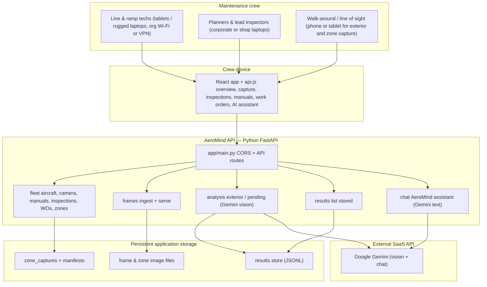
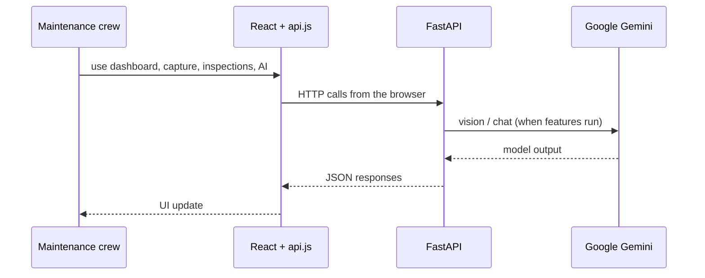

# AeroMind — High-level architecture

Mermaid diagrams: render in GitHub, VS Code, or [mermaid.live](https://mermaid.live).

This view matches the product shape: **maintenance crew** → **browser app** → **FastAPI** → **local persistence** and **Google Gemini**. There is **no** load balancer or TLS-terminating edge in the diagram. Implementation details (dev server, proxy, ports) live in `package.json` and `client/vite.config.js`.

---

## 1. System context

---

## 2. Request flow (logical)

*No infrastructure names — just the hop order the app is built around.*

